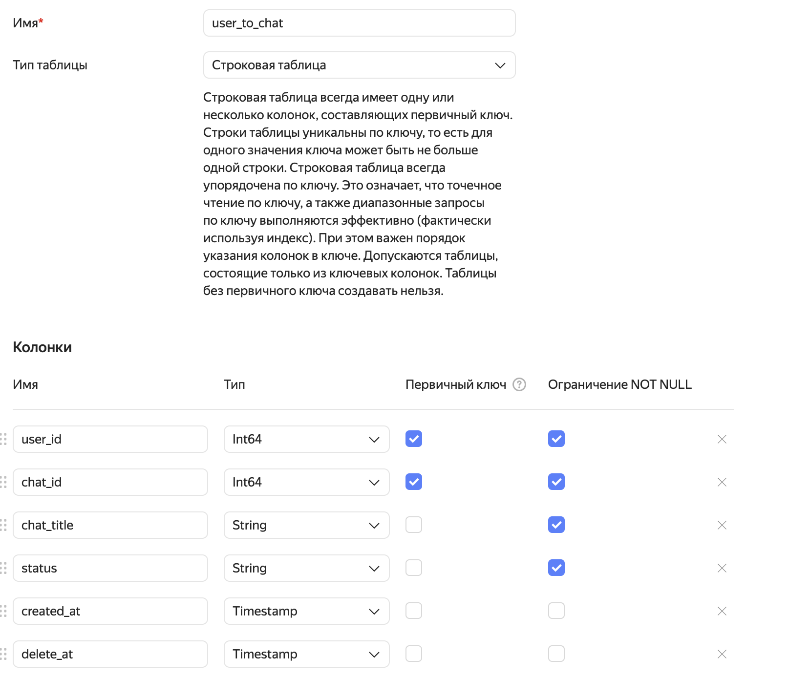

### Туториал
- Создать аккаунт в Яндексе
- Привязать карту
- Создать сервисный аккаунт `account`
    - Права: editor
    - Для аккаунт создать static key, записать идентификатор ключа и секретный ключ
- Создать object storage  (s3) `my-best-bucket`
    - Настройки: максимально 1ГБ, публичный доступ на чтение
- Создать message queue (sqs) `queue`
- Создать YDB
    - Нажать "подключиться" -> скопировать путь
    - Создать таблицу: 
- Создать TG (t.me/botfather) бота и сохранить токен
- Создать cloud function (lambda) `function`
  - runtime: go1.21
  - Код из zip архива отсюда: 
  - Memory: 128MB
  - Timeout: 3s
  - Выставить енвы
      - `teas_ydb__from_inside=true`
      - `teas_logger__logger_factory=json`
      - `teas_yc__access_key_id=<айди ключа>`
      - `teas_yc__secret_access_key=<секретный ключ>`
      - `teas_ydb__url=<юрл YDB>`
      - `teas_s3__bucket=<имя бакета>`
      - `teas_sqs__url=<юрл очереди>`
      - `teas_tg__token=<токен бота>`
- Настроить вебхук: `https://api.telegram.org/bot<Token>/setWebhook?url=<lambdaUrl>`